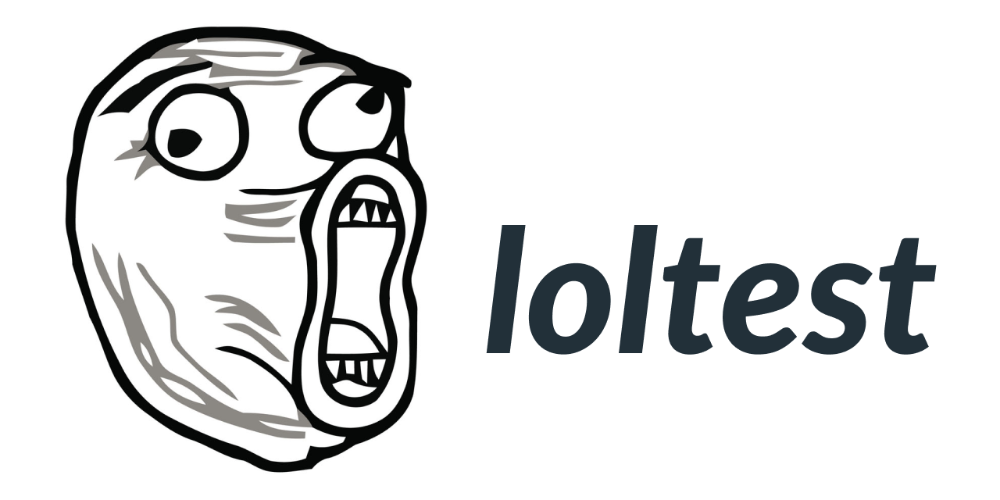

Bare minimum test runner for Typescript projects.

## Usage

In `package.json`:

```json
  "scripts": {
      "test": "loltest"
  }
```

In `test/foo.ts`:

```typescript
import assert from 'assert';
import { test } from 'loltest';

test('It works', () => {
    assert.deepEqual(2, 4);
});
```

Run like this:

```bash
$ npm test
...
✗ foo.ts It works: 2 deepEqual 4
```

### Select test file

Write some starting letters of the test file name to run
the tests in that file.

```bash
$ npx loltest fo
# Runs test/foo.ts
```

### Reporters

We bundle these reporters:

- `loltest` *(default)*
- `tap`

Choose between reporters with the `--reporter` CLI flag:

```bash
$ npx loltest --reporter=<reporter>
```

# Layout

Tests must be in the directory `<my_project>/test/`. Any test file with a name starting
`_` will be ignored.
